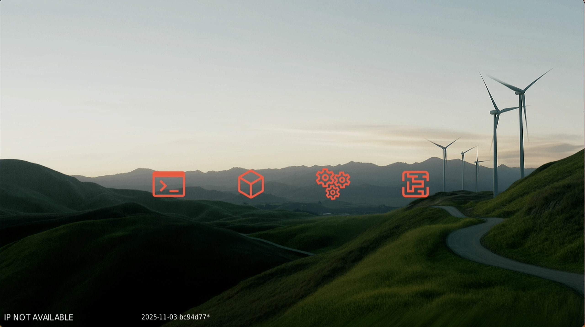
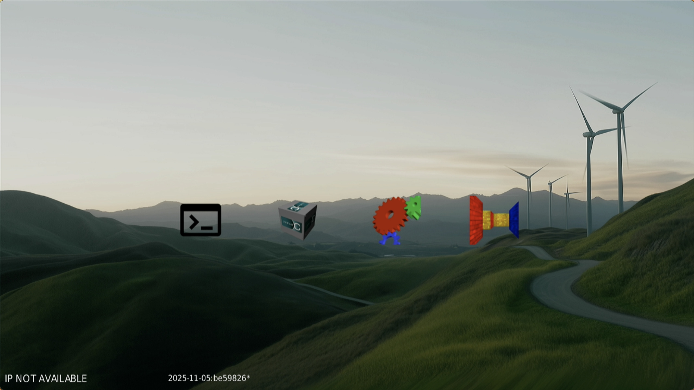
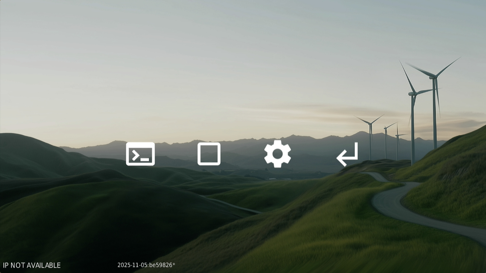
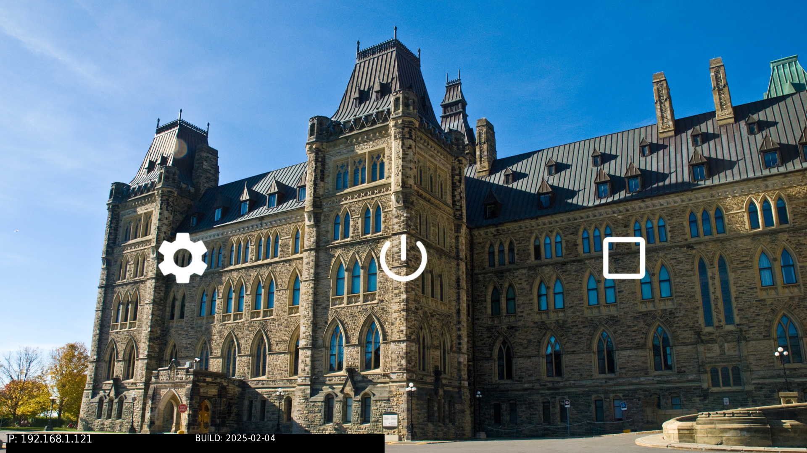

# snippets

## Overview

The snippets folder contains portions of build files that are used by
mkqnximage to create partitions for the SD card image generated by the project
build.  mkqnximage combines these files with boilerplate snippets to assemble
full build files (.build), that are required to generate partition files
(.part) files for the image generation process.

## Combination Rules

The initial combination is done by combining the common snippet files with the
target snippet files. If a target snippet file has the same name as a common
one, then the target specific one wins and is used; the common one is ignored
in this case.

After this initial combination, mkqnximage has specific rules governing how
individual snippets are used.  Each name of each snippet file has a prefix that
determines which build file, script or other file it is included in, a suffix
to make the file name unique, and optionally a string of the form 'NN' or '~NN'
that can be used to influence ordering with respect to other files using the
same prefix.  So for example:

    <prefix>.<suffix>    - Inserted in default postion
    <prefix>.80.<suffix> - Inserted before everything but lower number files
    <prefix>.~80.<suffix>- Inserted after everything except lowered numbered
                           files that include ~

### Snippet prefixes

The prefixes supported by mkqnximage are detailed in this section.

#### ifs_files

Allows for additional files to be included in the ifs partition.

#### system_files

Allows for additional files to be included in the system partition.

#### data_files

Allows for additional files to be included in the data partition.

#### ifs_env

Used mainly for creating procmgr symlinks and setting environment variables at
the beginning of the IFS start-up script.

#### ifs_start

Commands used for starting the system. This includes security policy loading
if appropriate. It is inserted at the end of the IFS start-up script, just
before execution of startup.sh or slm.

#### post_start

Included in post_startup.sh a shell script run at the end of startup.sh
and by the slm configuration file.

#### slm

Included in the slm configuration file.

#### profile

Included in /system/etc/profile.

#### passwd_file

Include content in the passwd file.

#### shadow_file

Include content in the shadow file.

#### group_file

Include content in the group file.

#### uids

Add uid definitions.

#### boot

Used to generate the boot entry in the IFS build file.

#### definitions

Add content to `_definitions.inc`, the file or C preprocessor definitions
used to modify the contents of other files.

#### options

Used to add procnto command line options and expand the size of disk partitions
and free inodes.

#### generate

Used to generate files out of snippet files.

#### secpolgen

Used to configure commands used when starting secpolgenerate.

#### secpolused

Contains secpol rules that should be treated as having been used and thus will
be added to generated policies.

#### qemu_options

Anything contained in snippet files with this prefix are added to the options
passed to QEMU when running the image.

## Snippets

Each target has two sets of snippets. One set is common to all targets, the
other is target specific. The common snippets are located in this directory.
The target specific snippets are located in a snippets sub-directory located
in the target's configuration directory.

Each set is created by taking the standard snippets for the set and
adding/overriding any variant specific snippets. So for example, if there was
a variant called 'big' then the set of snippets for this variant is made by
taking the snippets in the `common` sub-directory then copying any snippets
in `common/big` on top.

### Common Snippets

Snippets that are used by all CTI targets.

| Snippet                                                 | Purpose                                                                                                                                                                                                                                                                                                                                                                                                                                                                                                                                                                                                                                                             |
| ------------------------------------------------------- | ------------------------------------------------------------------------------------------------------------------------------------------------------------------------------------------------------------------------------------------------------------------------------------------------------------------------------------------------------------------------------------------------------------------------------------------------------------------------------------------------------------------------------------------------------------------------------------------------------------------------------------------------------------------- |
| data_files.custom                                       | This snippet is used to add files to the `/data` partition, such as configuration files for various services running on the device.  Customizations may be required here if a new service is ported and integrated, and it requires a file under `/data`.                                                                                                                                                                                                                                                                                                                                                                                                           |
| data_files.custom.abuild                                | This snippet adds folders required for abuild to operate correctly.                                                                                                                                                                                                                                                                                                                                                                                                                                                                                                                                                                                                 |
| data_files.custom.apk_root_data                         | This snippet integrates the local apk repo for qnx software packages.                                                                                                                                                                                                                                                                                                                                                                                                                                                                                                                                                                                               |
| data_files.custom.camera_demo                           | This snippet includes entries for the files required by the camera demos.                                                                                                                                                                                                                                                                                                                                                                                                                                                                                                                                                                                           |
| data_files.custom.etc_system_config                     | This snippet integrates the /etc/system/config folder.                                                                                                                                                                                                                                                                                                                                                                                                                                                                                                                                                                                                              |
| data_files.custom.fonts                                 | This snippet integrates font customizations folder.                                                                                                                                                                                                                                                                                                                                                                                                                                                                                                                                                                                                                 |
| data_files.custom.sudoers                               | This snippet integrates custom sudo ers configurations.                                                                                                                                                                                                                                                                                                                                                                                                                                                                                                                                                                                                             |
| data_files.custom.var_users                             | This snippets creates some extra folders in /var for the user accounts.                                                                                                                                                                                                                                                                                                                                                                                                                                                                                                                                                                                             |
| data_files.custom.weston_desktop                        | This snippet creates folders and files needed for the Weston desktop integrated into the image.                                                                                                                                                                                                                                                                                                                                                                                                                                                                                                                                                                      |
| data_files.home                                         | This snippet includes entries for the home directories of the image's users.<br/><br/>If a new utility is integrated and it can benefit from a files, such as configuration files, that exist within a user's home directory, those files can be added here for each user account that requires them.<br/><br/>If a new user account is added, extra entries would need to be added here to create the new user's home directory and extra configuration files. See the entries for qnxuser as an example of what entries to add for another user.                                                                                                                  |
| group_file.apk_support                                  | This snippet adds new group entries for sudo and abuild.                                                                                                                                                                                                                                                                                                                                                                                                                                                                                                                                                                                                            |
| ifs_env.~10.custom                                      | This snippet contains entries for setting up the basic runtime environment of the IFS.  No customizations require adjusting its content at this time.                                                                                                                                                                                                                                                                                                                                                                                                                                                                                                               |
| ifs_files.~10.custom                                    | This snippets makes additional IFS file adjustments required to integrate the core apk packages.                                                                                                                                                                                                                                                                                                                                                                                                                                                                                                                                                                    |
| ifs_files.serial_console                                | This snippet contains entries extra commands, related to the serial console, to add into the the IFS.                                                                                                                                                                                                                                                                                                                                                                                                                                                                                                                                                               |
| ifs_start.~30.builtin                                   | This snippets controls whether to startup SLM or run the startup.sh, depending on which build option is set.                                                                                                                                                                                                                                                                                                                                                                                                                                                                                                                                                        |
| post_start.~15.networking                               | This snippet contains extra commands, related to networking, to add into the startup script found at `/system/etc/startup/post_startup.sh`.                                                                                                                                                                                                                                                                                                                                                                                                                                                                                                                         |
| post_start.~19.fonts                                    | This snippets inserts font cache updates into the startup flow.                                                                                                                                                                                                                                                                                                                                                                                                                                                                                                                                                                                                     |
| post_start.~96.multimedia                               | This snippet contains extra commands, that start the multimedia renderer, to add into the startup script found at `/system/etc/startup/post_startup.sh`. The multimedia renderer is used by other utilities (such as `mmrplay`) for media playback.                                                                                                                                                                                                                                                                                                                                                                                                                 |
| profile.custom                                          | This snippet contains extra environment variables or entries to add into `/system/etc/profile`. The profile file is sourced by every instance of the shell and hence can be used to add global environment variables to each user's environment when they start a new shell.  A new open source service that is integrated, that would need environment variables to be defined to operate, would require changes to this snippet.                                                                                                                                                                                                                                  |
| slm.~20.custom.rootfs                                   | This snippet adds SLM entries that depend on rootfs task.                                                                                                                                                                                                                                                                                                                                                                                                                                                                                                                                                                                                           |
| slm.~60.custom.network                                  | This snippet adds SLM entrues that depend on network startup.                                                                                                                                                                                                                                                                                                                                                                                                                                                                                                                                                                                                       |
| system_files.custom.apk_bug_hack                        | This snippet adds some items to the image to address some temporary apk issues.                                                                                                                                                                                                                                                                                                                                                                                                                                                                                                                                                                                     |
| system_files.custom.apk_qnx_microkernel                 | This snippet add a symlink to interoperate with the qnx-microkernel apk package.                                                                                                                                                                                                                                                                                                                                                                                                                                                                                                                                                                                    |
| system_files.custom.apk_startup                         | This snippet defines scripts that are called during boot and apk startup flow.                                                                                                                                                                                                                                                                                                                                                                                                                                                                                                                                                                                      |
| system_files.custom.boot_anim                           | This snippet contains entries for HW specific files used to run the on-boot animations.<br/><br/>No customizations are expected to this file at this time.                                                                                                                                                                                                                                                                                                                                                                                                                                                                                                          |
| system_files.custom.camera_demo                         | This snippet is merged into the system build file. It contains entries related to sensor framework, camera libraries and related sample apps.                                                                                                                                                                                                                                                                                                                                                                                                                                                                                                                       |
| system_files.custom.common                              | This snippet is merged into the system partition build file, and serves as a general location where extra entries for files to be integrated into the system partition would be added.  Extra snippets where subsets of entries are added following a specific theme or service will be covered below.  For extra integrations, the user has a choice to update this snippet with extra system entries or create a subset snippet to do so.                                                                                                                                                                                                                         |
| system_files.custom.console                             | This snippet defines a custom script that drives the console login flow after startup.                                                                                                                                                                                                                                                                                                                                                                                                                                                                                                                                                                              |
| system_files.custom.fonts                               | This snippet injects some additional font dependencies specifically for certain binaries building with a different version of fontconfig and freetype.  This may no longer be required in a future release of this project.                                                                                                                                                                                                                                                                                                                                                                                                                                         |
| system_files.custom.gtk4                                | This snippet defines a startup script for the GTK+ 4 demo for QNX screen.                                                                                                                                                                                                                                                                                                                                                                                                                                                                                                                                                                                           |
| system_files.custom.io-snd                              | This snippet is merged into the system build file. It contains entries related to io-snd framework, ALSA support, and related sample apps.                                                                                                                                                                                                                                                                                                                                                                                                                                                                                                                          |
| system_files.custom.pam                                 | This snippet integrates script required to setup PAM.                                                                                                                                                                                                                                                                                                                                                                                                                                                                                                                                                                                                               |
| system_files.custom.python_setup                        | This snippet defines a python setup script that runs on first boot.                                                                                                                                                                                                                                                                                                                                                                                                                                                                                                                                                                                                 |
| system_files.custom.shared_assets                       | This snippet integrates shared asset folders.                                                                                                                                                                                                                                                                                                                                                                                                                                                                                                                                                                                                                       |
| system_files.custom.weston_desktop                      | This snippet integrates scripts that are required to startup the desktop.                                                                                                                                                                                                                                                                                                                                                                                                                                                                                                                                                                                           |
| system_files.custom.window_managers                     | This snippet contains entries relating to the two window managers integrated into the project, as well as their assets and configuration files.  Updates may be made to this snippet in future releases, but end users can modify this snippet as per customization options that will be described in following sections.                                                                                                                                                                                                                                                                                                                                           |
| system_files.custom.window_managers_demolauncher_config | This snippet contains entries related to the configuration of the demolauncher window manager. It is broken out separately from the main `system_files.custom.window_managers` file in order to allow variant specific demolauncher configuration.                                                                                                                                                                                                                                                                                                                                                                                                                  |
| wifi.custom (optional)                                  | If this snippet is added, it can contain a network block that can get injected into the wpa_supplicant.conf file for Wi-Fi settings.  See the [Wi-Fi](https://www.qnx.com/developers/docs/qnxeverywhere/com.qnx.doc.target_images/topic/qsti/install.html#wi-fi) section of the Quick start image target guide for more details on how to populate the file.<br/><br/>Note that this method of setting Wi-Fi settings is not recommended unless your image is slated for devices that are operating in a fixed environment, such as a school / corporate lab or a guest network, as opposed to an image being shared with others in the developer community abroad. |

## Customizations

Several customizations are possible with this project.

Below we will review the differences in how existing customizations would be
performed, and we will also cover some new customizations. Where customizations
are made differs with this project than on the device.
Look for notes below pointing out the differences.

Once customizations are made, you will need to rebuild the image and flash to
an SD card to then try the changes on a device.

### Configuring cURL

This project includes changes that pre-configure the installed version of cURL
with root certificates downloaded during the build. Any instructions in the

Quickstart wiki related to configuring cURL are no longer required.
A new script called updatecacert has been added to download updated
certificates in the future on a live device. The build itself will download a
fresh set of certificates if a clean operation is performed before a new build.

### Keyboard layout

The instructions for changing the keyboard layout can be found in the
[Keyboard layout](https://www.qnx.com/developers/docs/qnxeverywhere/com.qnx.doc.target_images/topic/qsti/next-steps.html#keyboard-layout)
section of the the Quick start target image guide.

To make the equivalent change for this project, to incorporate into the build
itself, pull the contents of the file
`qnx800/target/qnx/aarch64le/usr/lib/graphics/drm-rpi5/graphics-rpi5-2xhdmi.conf`
into the target specific snippet `system_files.custom.graphics` to make it an
inline declaration and make the updates to the inline declaration.

Alternatively you can also make a local copy of this file, modify it and update the
target snippet file `system_files.custom.graphics` to point to the local copy.

### Display resolution

The instructions for changing the display resolution can be found in the
[Display  resolution](https://www.qnx.com/developers/docs/qnxeverywhere/com.qnx.doc.target_images/topic/qsti/next-steps.html#display-resolution)
section of the Quick start target image guide.

To make the equivalent change for this project, to incorporate into the build
itself, pull the contents of the file
`qnx800/target/qnx/aarch64le/usr/lib/graphics/drm-rpi5/graphics-rpi5-2xhdmi.conf`
into the target specific snippet `system_files.custom.graphics` to make it an
inline declaration and make the updates to the inline declaration.

Alternatively you can also make a local copy of this file, modify it and update the
target snippet file `system_files.custom.graphics` to point to the local copy.

The instructions that rely on runtime commands do not apply for build changes
so you need to know the display resolution in advance, or make a guess, build
the image, then double check via runtime instructions on the device, and then
you can go back and try the change again and rebuild the image with the correct
settings.

### Camera

If you wish to experiment with camera support, you can adjust the default
configuration for launch by commenting (or uncommenting) the entries in the
target specific [post_start.~30.sensor_framework](post_start.~30.sensor_framework)
snippet, where the sensor service is started.

**NOTE** Not all camera configurations are available for all targets. The examples given below are for the RPi4 target.

For example, look for these lines:

    ```bash
    # Simulator camera i.e. color bars
    sensor -U 521:521,1001 -r /system/share/sensor -c /system/etc/system/config/sensor_demo.conf
    ```

and comment out the command as follows:

    ```bash
    # Simulator camera i.e. color bars
    #sensor -U 521:521,1001 -r /system/share/sensor -c /system/etc/system/config/sensor_demo.conf
    ```

and then look for these lines:

    ```bash
    # Camera Module 3
    #sensor -U 521:521,1001 -b external -r /system/share/sensor -c /system/etc/system/config/camera_module3.conf
    ```

and change to:

    ```bash
    # Camera Module 3
    sensor -U 521:521,1001 -b external -r /system/share/sensor -c /system/etc/system/config/camera_module3.conf
    ```

to try out the camera samples with Raspberry PI Camera Module v3, once you
build the image, flash it to an SD card with a device.

Review the other configurations to find the appropriate configuration for any
other supported camera that you may have.

### Adding binaries

Adding new binaries to the image is somewhat easier when you can build the
image yourself.

The most straightforward way to add prebuilt binaries would be to:

1. Add the prebuilt binary to the [system](../system) folder, in the appropriate
folder or create a folder or folders with the same relative path as it would
appear in the system partition on the device.

2. Add an entry, similar to the example below, to
[system_files.custom.common](system_files.custom.common) or a new
partial add-on snippet for the system partition:

        ```bash
        bin/gpio-bcm2711=bin/gpio-bcm2711
        ```

The path to the left of the "=" is the relative path to place the file to
`/system` on the device, and the path to the right is the relative path inside
the [system](../system) folder in this project.

What about binaries that are built from open source projects? They are installed
in the staging area located at [src/stage](../src/stage) so you need to account
for its relative path from that location for the right side expression, and you
still set the left side of the entry to the relative system path on the device.

### Customizing the Welcome screen / Desktop

Existing instructions for adjusting the Welcome screen placeholder desktop icons
can be found in the
[Customizing the Welcome screen](https://www.qnx.com/developers/docs/qnxeverywhere/com.qnx.doc.target_images/topic/cti/snippets_customization.html#customizing-the-welcome-screen)
section of the Custom target image guide for more details.

We will review how to do the same customizations in this project,
and more, below.

#### Customizing demolauncher icons

The current demolauncher app has been updated to support up to 10 icons.  Previously
it supported only 3 icons specified in the right.desktop, left.desktop and middle.desktop
files.  Up to 10 desktop files can be supplied in the directory.  Demolauncher will load
the first 10 desktop files and display the icons in alphabetical order based on the 'Name'
tag provided in the desktop file.

The current desktop files are leveraging QNX Design icons that were
integrated in the assets/icon folder.
The screenshot below shows how the default demolauncher looks like on first
boot, without customizations:



Let's try changing the terminal, gears, maze and cube icon, and point them
to the terminal_black, gles2-gears, gles2-maze and vkcube.png icons
respectively. You can use the larger versions of those desktop icons that
are included in the project.

Look for this portion of the
[system_files.custom.window_managers_demolauncher_config](system_files.custom.window_managers_demolauncher_config)
snippet:

    ```bash
    [type=file uid=0 gid=0 perms=0644] etc/desktop_files/terminal.desktop={
    [Desktop Entry]
    Name=Terminal
    Exec=/system/bin/st /system/etc/st_boot.sh
    Icon=/system/share/icons/qnx_coral_terminal_large.png
    Categories=Utilities
    }

    [type=file uid=0 gid=0 perms=0644] etc/desktop_files/maze.desktop={
    [Desktop Entry]
    Name=maze
    Exec=/system/bin/gles2-maze
    Icon=/system/share/icons/qnx_coral_maze_large.png
    Categories=Utilities
    }

    [type=file uid=0 gid=0 perms=0644] etc/desktop_files/gears.desktop={
    [Desktop Entry]
    Name=gears
    Exec=/system/bin/gles3-gears
    Icon=/system/share/icons/qnx_coral_gears_large.png
    Categories=Utilities
    }
    ```

and change to:

    ```bash
    [type=file uid=0 gid=0 perms=0644] etc/desktop_files/terminal.desktop={
    [Desktop Entry]
    Name=Terminal
    Exec=/system/bin/st /system/etc/st_boot.sh
    Icon=/system/share/icons/terminal_black.png
    Categories=Utilities
    }

    [type=file uid=0 gid=0 perms=0644] etc/desktop_files/maze.desktop={
    [Desktop Entry]
    Name=maze
    Exec=/system/bin/gles2-maze
    Icon=/system/share/icons/gles2-maze.png
    Categories=Utilities
    }

    [type=file uid=0 gid=0 perms=0644] etc/desktop_files/gears.desktop={
    [Desktop Entry]
    Name=gears
    Exec=/system/bin/gles3-gears
    Icon=/system/share/icons/gles2-gears.png
    Categories=Utilities
    }
    ```

Also look for this portion in the target specific demolauncher config snippet under the target
directory

    ```bash
    [type=file uid=0 gid=0 perms=0644] etc/desktop_files/vkcube.desktop={
    [Desktop Entry]
    Name=cube
    Exec=/system/bin/vkcubepp
    Icon=/system/share/icons/qnx_coral_cube_large.png
    Categories=Utilities
    }
    ```

and change to:

    ```bash
    [type=file uid=0 gid=0 perms=0644] etc/desktop_files/vkcube.desktop={
    [Desktop Entry]
    Name=cube
    Exec=/system/bin/vkcubepp
    Icon=/system/share/icons/vkcube.png
    Categories=Utilities
    }
    ```

After you rebuild, flash the image to the SD card and boot the device.
You will see the default icons replaced with color icons included in the image:



Alternatively, you could apply this update instead:

    ```bash
    [type=file uid=0 gid=0 perms=0644] etc/desktop_files/terminal.desktop={
    [Desktop Entry]
    Name=Terminal
    Exec=/system/bin/st /system/etc/st_boot.sh
    Icon=/system/share/icons/terminal_white_large.png
    Categories=Utilities
    }

    [type=file uid=0 gid=0 perms=0644] etc/desktop_files/maze.desktop={
    [Desktop Entry]
    Name=maze
    Exec=/system/bin/gles2-maze
    Icon=/system/share/icons/google/maze_icon_large_white.png
    Categories=Utilities
    }

    [type=file uid=0 gid=0 perms=0644] etc/desktop_files/gears.desktop={
    [Desktop Entry]
    Name=gears
    Exec=/system/bin/gles3-gears
    Icon=/system/share/icons/google/gears_icon_large_white.png
    Categories=Utilities
    }
    ```

and

    ```bash
    [type=file uid=0 gid=0 perms=0644] etc/desktop_files/vkcube.desktop={
    [Desktop Entry]
    Name=cube
    Exec=/system/bin/vkcubepp
    Icon=/system/share/icons/google/cube_icon_large_white.png
    Categories=Utilities
    }
    ```

After you rebuild, flash the image to the SD card and boot the device, you
will see the placeholder icons replaced with additional Google Material Design
icons. The same demo apps launch with the above change, if you prefer the look
of flatter icons from this set:



#### Customizing the demolauncher background image

Aside from modifying the icons, you can also switch the background image used
for the demolauncher to one of your own background images.

The first thing you need to do is add the new background image to the window
manager's snippet.

Look for this portion of the
[system_files.custom.window_managers_demolauncher_config](system_files.custom.window_managers_demolauncher_config)
snippet:

    ```bash
    [type=file uid=0 gid=0 perms=0444] etc/images/background_1080p.png=images/background_1080p.png
    ```

and then add a similar entry for your own image added to the folder
[assets/images](../assets/images). In this case, I will add a background image
called DSC_0133_1080p.png, following the line above in the snippet:

    ```bash
    [type=file uid=0 gid=0 perms=0444] etc/images/DSC_0133_1080p.png=images/DSC_0133_1080p.png
    ```

Note: This step is only adding a 1080p image, which will work with 1080p
displays, but if your display is 720p, add a customized 720p image instead.

The next change required is to update the
[post_start.~40.window_manager](post_start.~40.window_manager)
snippet to update the demo launcher command to provide the new background
image base name.

Look for this line:

    ```bash
        demolauncher -a /system/etc/desktop_files &
    ```

and change it to:

    ```bash
        demolauncher -a /system/etc/desktop_files -b /system/etc/images/DSC_0133 &
    ```

After you rebuild, flash the image to the SD card and boot the device, you
will see the default background image replaced with your own:



### Thermal throttling

Previous instructions for checking the CPU temperature can be found in the
[Thermal throttling](https://www.qnx.com/developers/docs/qnxeverywhere/com.qnx.doc.target_images/topic/cti/snippets_customization.html#thermal-throttling)
section of the Custom target image guide for more details.

### Touchscreen

The instructions for adjusting the touchscreen configuration can be found in the
[Touchscreen](https://www.qnx.com/developers/docs/qnxeverywhere/com.qnx.doc.target_images/topic/cti/snippets_customization.html#touchscreen)
section the Custom target image guide for more details.

To make the equivalent change for this project, to incorporate into the build
itself, the change described above has to be made to
[../system/etc/system/config/mtouch.conf](../system/etc/system/config/mtouch.conf)
instead.

The project's [mtouch.conf](../system/etc/system/config/mtouch.conf) can be
directly populated with the configuration info for one of the tested touch
screens listed in our documentation on qnx.com, or you may want to flash the
image with this file unpopulated, to collect the information you need to fill
in the correct parameters for your touchscreen.

For example, the following is the configuration for a Waveshare WS170120 touchscreen:

    ```bash
    begin mtouch
      driver = hid
      display = hdmi
      options=verbose=11,vid=0x0eef,did=0x0005,verbose=6,width=4096,height=4096,max_touchpoints=5

      scaling = /system/etc/system/config/scaling.conf
    end mtouch
    ```

If you have the same touchscreen, you can paste this into The project's
[mtouch.conf](../system/etc/system/config/mtouch.conf) and then rebuild the
project to test if the touch screen is now working.
